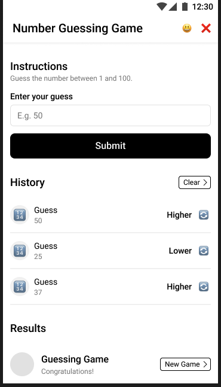

# Number guessing game

this project will be a simple number guessing game made with HTML, CSS, and vanilla JavaScript.

### Wireframe

## Game Details
the game will be a simple number guessing game with multiple difficulties. the player will need to guess a number the computer randomly chooses with various ranges depending on the difficulty.

### Start Screen

- the screen players will see when first starting the game. this is where the player will choose a difficulty

### Play Screen

- the screen players will see when actively playing, remember to guess carefully!

### Lose & Win Screens

- after either guessing the correct number, or expending all available lives, the player will be presented with a win or lose screen respectively.

## Sources
random number player needed to guess: https://www.w3schools.com/js/js_random.asp  
chatGPT: Mainly for debugging  
